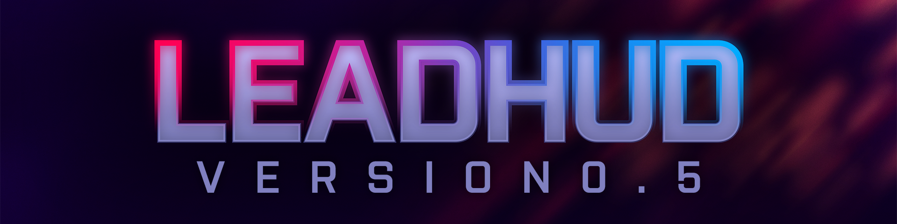
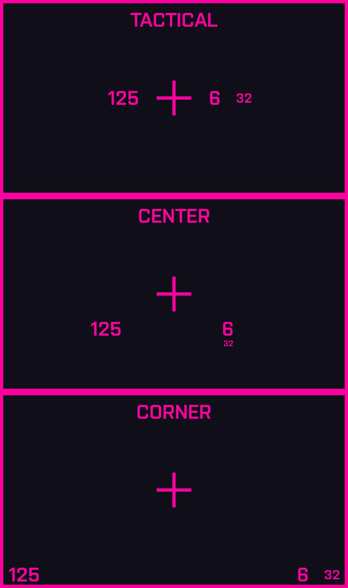

# NOTICE: DISCONTINUED

## LeadHUD is no longer in active development. Please use OneHUD or wait for this HUD's replacement to finish.

# About

LeadHUD is a modern, functional HUD for Team Fortress 2, taking inspiration from modern FPS games.

LeadHUD is still work in progress and will remain so for a while. Plans are to have almost every element customized and to fit in with the current style of the HUD.

# Notice

`-dxlevel 90` or higher is required for this HUD to work properly. Anything lower will cause extreme visual issues and pull the hud below usability. If you do not know what this means, you probably are using `-dxlevel 90` or higher.

# Installation

Clone the repo with git or download the zip manually, extract it, and drag and drop the `leadhud-main` folder into the `/tf/custom/` folder.

# Customization

### Crosshairs

This HUD has custom crosshair support. By default, it acts as a hitmarker, but can be changed to function like a normal crosshair. Check the `hudlayout.res` file for more info.

### Health and Ammo Position

The files `hudammoweapons.res` and `hudplayerhealth.res` link to seperate files which have the health and ammo in different positions. You can choose between 3 different positions for each file. The options are Tactical, Center, and Corner.

# Streamer Mode

This HUD has streamer mode support, which hides player names and makes a cursory attempt at making you anonymous. You can activate it with `streamer_mode` in the console or by using the in-game button.

# Credits

- CriticalFlaw : **FlawHUD**

- JarateKing : **HUD guides**

- Fraxinus : **Extensive Testing**

- InkyTheFox : **Testing**

- [VALVE] Twilight Sparkle : **Testing**